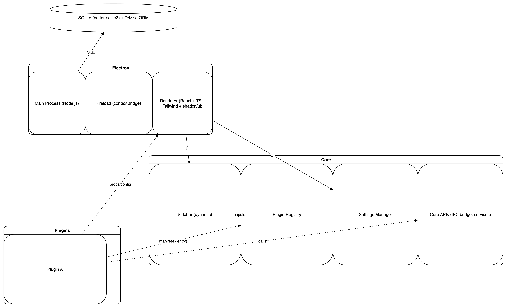

# Documentation Technique de l’Application Electron avec Core + Plugins

## Objectifs & Périmètre

Cette documentation décrit l’architecture technique de notre application Electron, inspirée du modèle d’Obsidian, basée
sur un **core** principal extensible via des **plugins**.  
L’objectif est de fournir une plateforme modulaire permettant d’ajouter des fonctionnalités via des plugins tout en
gardant un noyau stable et performant.

Le périmètre couvre :

- L’architecture globale du système.
- Le fonctionnement du système de plugins (manifest, cycle de vie, settings).
- La gestion des paramètres utilisateurs.
- La structure du dépôt de code.
- La roadmap de développement.

---

## Architecture Globale

L’application est composée de trois parties principales :

1. **Core**  
   Le cœur de l’application gère la fenêtre Electron, la base de données locale, la communication entre plugins et le
   système, ainsi que la gestion des paramètres globaux.

2. **Plugins**  
   Modules additionnels chargés dynamiquement par le core. Chaque plugin est isolé et peut étendre l’interface, ajouter
   des commandes, ou modifier le comportement.

3. **Base de Données (DB)**  
   Stockage local des données utilisateurs, configurations et état des plugins. Utilise un format JSON ou une base
   légère intégrée (ex : SQLite).

### Diagramme d’architecture globale



---

## Système de Plugins

Notre architecture de plugins est pensée pour supporter des plugins tiers, inspirée des modèles d’Obsidian, VS Code et Figma. Elle vise à offrir une plateforme sécurisée, modulaire et évolutive permettant aux développeurs externes d’étendre les fonctionnalités de l’application tout en garantissant stabilité et sécurité.

### Manifest

Chaque plugin doit fournir un fichier `manifest.json` décrivant ses métadonnées, permissions, points d’entrée et paramètres. Voici un exemple complet et représentatif :

```json
{
  "id": "plugin-exemple-avance",
  "name": "Plugin Exemple Avancé",
  "version": "1.2.3",
  "description": "Un plugin d'exemple avancé avec permissions et icône",
  "entry": "dist/main.js",
  "icon": "assets/icon.png",
  "author": "Auteur Externe",
  "coreApiVersion": ">=1.0.0",
  "permissions": [
    "network",
    "storage",
    "db"
  ],
  "settingsSchema": {
    "enableFeatureX": {
      "type": "boolean",
      "default": true,
      "description": "Activer la fonctionnalité X"
    },
    "maxItems": {
      "type": "number",
      "default": 10,
      "description": "Nombre maximal d'items"
    }
  }
}
```

### Permissions

Les plugins peuvent déclarer les permissions dont ils ont besoin pour fonctionner. Ces permissions permettent de restreindre les capacités d’un plugin et d’assurer la sécurité globale. Les permissions possibles incluent :

- **network** : accès aux requêtes réseau (HTTP/HTTPS).
- **storage** : accès au stockage local sécurisé.
- **db** : accès à la base de données utilisateur via API contrôlée.
- **fs** : accès limité au système de fichiers local.
- **notifications** : permission d’afficher des notifications système.
- **clipboard** : accès au presse-papiers.
  
Ce modèle s’inspire des permissions utilisées dans Chrome et Figma, et permet à l’utilisateur de contrôler ce que chaque plugin peut faire.

### Cycle de vie

Le système de plugins gère un cycle de vie complet pour chaque plugin, avec les hooks suivants :

- **install()** : appelé lors de la première installation du plugin, pour effectuer des initialisations ou migrations.
- **activate()** : appelé à chaque activation du plugin (ex : au démarrage ou réactivation), pour initialiser les fonctionnalités.
- **deactivate()** : appelé lors de la désactivation temporaire, pour nettoyer les ressources sans désinstaller.
- **uninstall()** : appelé lors de la suppression définitive du plugin, pour nettoyer entièrement les données et ressources.
- **load()** et **unload()** : pour charger et décharger les ressources dynamiquement.

Certains plugins peuvent s’exécuter en mode isolé, soit dans un **worker** (Web Worker ou Worker Thread) soit dans un **process** séparé, garantissant ainsi une isolation mémoire et de sécurité renforcée.

Le core orchestre ces hooks pour garantir un état cohérent et une intégration fluide des plugins.

### Settings

Les paramètres de chaque plugin sont définis via un **JSON Schema** dans le manifest (`settingsSchema`). Ce schema est validé côté core afin d’assurer la conformité et la sécurité des données.

Le core utilise ce schema pour générer automatiquement une interface utilisateur intuitive avec la bibliothèque **shadcn/ui**, permettant à l’utilisateur de modifier les paramètres sans effort.

Les valeurs modifiées sont ensuite sauvegardées dans la base de données via **Drizzle ORM**, garantissant une persistance fiable et une synchronisation entre sessions.

### Plugin SDK

Pour faciliter le développement de plugins tiers, un **Plugin SDK** est exposé via le package `@app/plugin-sdk`. Ce SDK fournit :

- Des types TypeScript stricts pour garantir la sécurité des APIs.
- Des wrappers sécurisés pour accéder aux fonctionnalités du core (ex : accès à la DB, UI, notifications).
- Des helpers pour la gestion des événements, commandes, et communication entre plugins.

Ce SDK est la seule interface officielle permettant aux plugins d’interagir avec le core, assurant ainsi modularité et sécurité.

---

## Sidebar Dynamique & PluginHost

La **sidebar** est un composant UI dynamique qui affiche des éléments ajoutés par les plugins.

Le **PluginHost** est responsable :

- Du chargement et de la gestion des plugins.
- De l’intégration des éléments UI des plugins dans la sidebar.
- De la communication entre core et plugins.

---

## Gestion des Settings

Les paramètres sont définis par un JSON Schema dans le manifest de chaque plugin. Exemple :

```json
{
  "enableFeatureX": {
    "type": "boolean",
    "default": true,
    "description": "Activer la fonctionnalité X"
  },
  "maxItems": {
    "type": "number",
    "default": 10,
    "description": "Nombre maximal d'items"
  }
}
```

Le core utilise ce schema pour générer dynamiquement une interface utilisateur permettant aux utilisateurs de modifier
ces paramètres, avec validation automatique.

---

## Structure du Repo

```
/core
  /src
    main.ts
    pluginHost.ts
    settings.ts
/plugins
  /plugin-exemple
    manifest.json
    main.js
/db
  database.sqlite
/docs
  DOCS.md
package.json
```

- `/core` : Code du noyau de l’application.
- `/plugins` : Dossier contenant tous les plugins.
- `/db` : Fichiers liés à la base de données.
- `/docs` : Documentation.

---

## Exemple de Manifest Plugin

```json
{
  "id": "plugin-todo",
  "name": "Todo List",
  "version": "0.1.0",
  "author": "Dev",
  "description": "Un plugin pour gérer des listes de tâches",
  "main": "todo.js",
  "minCoreVersion": "1.0.0",
  "settingsSchema": {
    "showCompleted": {
      "type": "boolean",
      "default": false,
      "description": "Afficher les tâches terminées"
    }
  }
}
```

---

## Roadmap de Développement

1. **Phase 1 - Core**
    - Initialisation du projet Electron.
    - Implémentation du PluginHost.
    - Gestion basique des plugins (chargement, activation, désactivation).

2. **Phase 2 - Plugins**
    - Définition et validation du format manifest.
    - Gestion des settings via JSON Schema.
    - Intégration des plugins dans l’UI (sidebar).

3. **Phase 3 - Base de données**
    - Mise en place du stockage local.
    - Synchronisation état plugins / settings.

4. **Phase 4 - UX & UI**
    - Sidebar dynamique évoluée.
    - Interface de gestion des plugins.

5. **Phase 5 - Tests & Documentation**
    - Couverture de tests unitaires et d’intégration.
    - Rédaction complète de la documentation technique et utilisateur.

---

Cette architecture modulaire garantit une extensibilité importante tout en conservant une base stable et maintenable.
Les plugins peuvent être développés et déployés indépendamment, facilitant l’évolution de l’application.
